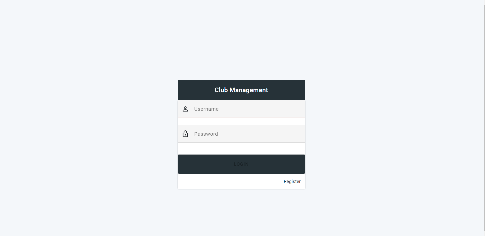

# Club Sport Management Application

Welcome to the Club Sport Management Application! This application is designed to help you efficiently manage your club's activities, members, coaches, equipment, and more. It provides various features such as authentication, member management, coach management, equipment management, activity management, and a comprehensive dashboard for tracking important statistics.

## Screenshots

Here are some screenshots showcasing different parts of the application:

### Authentication

### Dashboard

### Member Management

### Coach Management

### Equipment Management

### Activity Management

## Features

- **Authentication:** Secure user authentication and authorization system to ensure only authorized individuals can access the application.
- **Member Management:** CRUD operations for managing club members. Ability to add and update subscription details for members. Additionally, it offers the ability to filter members based on specific criteria.
- **Coach Management:** CRUD operations for managing coaches within the club.
- **Equipment Management:** CRUD operations for managing club equipment.
- **Activity Management:** CRUD operations for managing club activities.
- **Dashboard:** Provides detailed statistics on subscription categories, income, and member statistics. Offers filtering options for daily, weekly, monthly, and yearly views.

## Getting Started

To get started with the Club Sport Management Application, follow these steps:

1. Clone the repository: `git clone https://github.com/yaszag/club-management-client.git`
2. Install the required dependencies: `npm install`
3. Build the application: `ng build`
4. Start the application: `ng serve`
5. Open your web browser and navigate to `http://localhost:4200`

Please note that you will need to have Angular CLI installed on your system to run this application.

